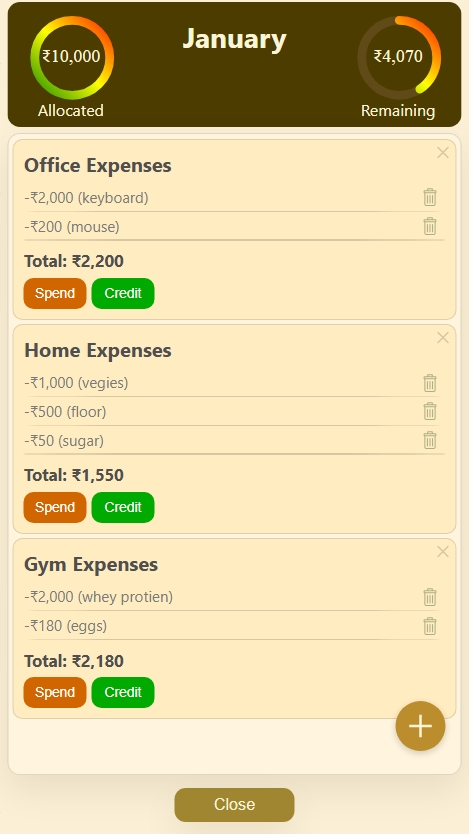
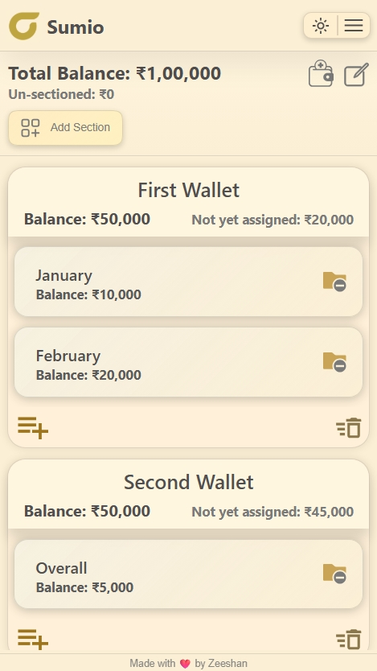

# 💰 Sumio

**Sumio** is a personal expense tracking Progressive Web App (PWA) that I built to replace my own habit of tracking expenses manually in notes and spreadsheets.

I wanted something **fast**, **offline-first**, and **visually clean**, without unnecessary complexity — so I built Sumio exactly the way I wanted to use it.

---

## ✨ Why Sumio?

Most expense apps are either:
- Too complex for daily use  
- Too minimal to be actually useful  

Sumio sits in the middle — structured, flexible, and calm to use.

---

## 🚀 Features

- 📊 **Partition-based expense tracking**
  - Organize money into sections (Scholarship, Personal, etc.)
  - Allocate and track balances independently

- 🧾 **Detailed expense breakdown**
  - Expenses → Sub-details → Individual entries
  - Clear visibility of where money goes

- 📴 **Offline-first (PWA)**
  - Works fully offline
  - Installable on mobile like a native app

- 🎨 **Multiple themes**
  - Dark theme (default)
  - Ivory theme (premium, soft look)
  - Theme persists across sessions

- 🔄 **Export / Import data**
  - Backup and restore your data using JSON

- ⚡ **Smooth & responsive UI**
  - Optimized for mobile usage
  - Minimal animations for clarity

---

## 🖼️ Screenshots

## 🛠️ Tech Stack

Sumio is built entirely with **core web technologies**, without relying on any frameworks or libraries.

- **HTML**
- **CSS**
  - CSS Variables for dynamic theming (Dark / Ivory)
- **Vanilla JavaScript**
- **LocalStorage** (for persistent data)
- **Service Workers** (offline-first support)
- **PWA APIs**

> No frameworks.  
> No libraries.  
> Everything built from scratch.

---

## 📦 Installation

### 🌐 Web
You can use Sumio directly in your browser:

👉 **https://sumio.netlify.app**

---

### 📱 PWA (Mobile App Experience)

1. Open the app in your mobile browser  
2. Tap **Install** (or *Add to Home Screen*)  
3. Use Sumio like a native app — offline supported  

---

## 🔐 Data & Privacy

Your privacy is a core principle of Sumio.

- All data is stored **locally on your device**
- No servers
- No accounts
- No tracking
- No analytics

> Your data stays with you — always.

---

## 🧠 Learnings

Building Sumio helped me deeply understand:

- State management without frameworks
- Offline-first application design
- Service workers & cache strategies
- Mobile UX constraints
- Scalable data modeling using plain JavaScript

This project pushed me to think carefully about **architecture**, **performance**, and **long-term maintainability**.

---

## 👤 About Me

I’m **Shah Zeeshan**, a Computer Science student at  
**College of Engineering Trivandrum**.

I enjoy building clean, thoughtful tools that solve real problems —  
especially the ones I personally use.

Sumio started as a personal need, and gradually evolved into a complete, polished product.

---

## 🔗 Links

- 🌐 **Live App:** https://sumio.netlify.app  
- 🧑‍💻 **GitHub:** https://github.com/Zeeshan-Zahoor  
- 💬 **Feedback / Issues:** https://github.com/Zeeshan-Zahoor/sumio/issues  
